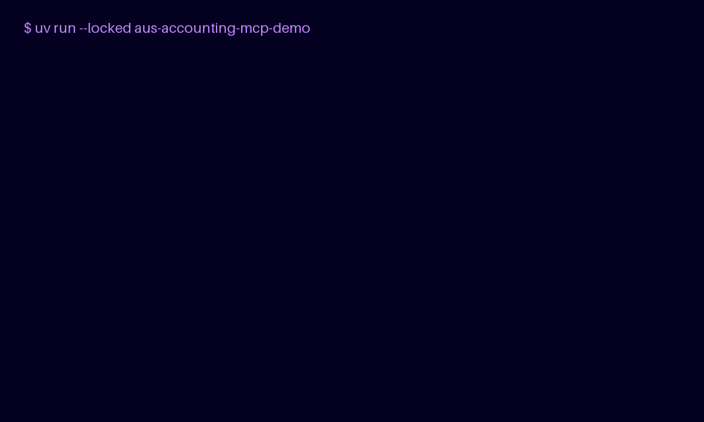

# Aus Accounting MCP

```
+--------------------------------------------------------+
|                   Aus Accounting MCP                   |
+--------------------------------------------------------+
|          MCP server for AU tax review engines          |
+---------------------------+----------------------------+
| DR  what it gives you     | CR  what it needs          |
+---------------------------+----------------------------+
| AU tax review MCP tools   | MCP-capable host client    |
| uses reviewed engines     | uv or uvx to install it    |
| synthetic SBR fixtures    | -                          |
+---------------------------+----------------------------+
```

[](https://github.com/ryanduguid/aus-accounting-mcp/actions/workflows/ci.yml)
[](https://www.python.org/)
[](https://modelcontextprotocol.io/)
[](https://registry.modelcontextprotocol.io/v0.1/servers/io.github.ryanduguid%2Faus-accounting/versions/latest)
[](https://glama.ai/mcp/servers/ryanduguid/au-tax-mcp-server)
[](https://opensource.org/licenses/MIT)

[30-second proof](#30-second-proof) · [Install](#install) · [Client setup](#client-integration) · [Tool reference](#tools) · [Release notes](RELEASE_NOTES.md)

**Aus Accounting MCP** is a local MCP facade over reviewed Australian computational accounting engines. Compatible with Claude Desktop, Claude Code, Cursor, Codex and Antigravity.

Payday Super is an experimental review (not a compliance determination). Division 7A is **refused** - there is no repayment calculator. SBR payloads are synthetic fixtures.

> [!WARNING]
> **Not tax advice.** This server returns structured results, refusals, and citations. It does not lodge, and it does not replace a registered agent. See [DISCLAIMER.md](DISCLAIMER.md).

This is a **computational** MCP, not a hosted ATO document store. It applies statutory tests to figures the operator supplies (Payday Super timing, ATO small-business benchmark ratios) and refuses Division 7A. For looking up rulings, use a document-retrieval MCP. Comparison: [Australian tax tools for AI agents](https://ryanduguid.github.io/tools/australian-tax-ai-agents/).

This server does **not** reimplement tax law. Payday Super and ATO small-business benchmarks are delegated to:

- [payday-super-checker](https://github.com/ryanduguid/payday-super-checker) (`payday-super-checker`)
- [ato-benchmark-compare](https://github.com/ryanduguid/ato-benchmark-compare) (`ato-benchmark-compare`)

Division 7A is **refused** until a reviewed engine exists. SBR payloads are **synthetic fixtures**, not lodgments.

## 30-second proof



**Unreleased source:** from a repository checkout, run the fabricated
demonstration without starting the stdio server:

```bash
uv run --locked aus-accounting-mcp-demo
```

The [checked text transcript](docs/quick-proof.txt) is the accessible source of truth for the animation. Its registered MCP calls return a synthetic BAS fixture with synthetic true and not_a_lodgment true, then an intentional Division 7A refusal with ERR_POLICY_DIV7A_REFUSED.

Expected structured success:

```text
synthetic: true
not_a_lodgment: true
form_type: BAS_AU_ACTIVITY_STATEMENT
summary.total_payable_to_ato: "42500.00"
```

Expected structured refusal:

```text
code: ERR_POLICY_DIV7A_REFUSED
available: false
reviewed_engine: false
```

The example is fabricated, is not a lodgment, is not tax advice, and requires human review before any consequential accounting action. It neither uses client data nor contacts external services.

Name mapping: public name Aus Accounting MCP; repository aus-accounting-mcp; Python distribution aus-accounting-mcp; stdio MCP executable aus-accounting-mcp; demonstration executable aus-accounting-mcp-demo; MCP Registry identity io.github.ryanduguid/aus-accounting.

Canonical published release and compatibility references: [CI](https://github.com/ryanduguid/aus-accounting-mcp/actions/workflows/ci.yml), [v0.1.5 release](https://github.com/ryanduguid/aus-accounting-mcp/releases/tag/v0.1.5), [PyPI 0.1.5](https://pypi.org/project/aus-accounting-mcp/0.1.5/), [MCP Registry 0.1.5](https://registry.modelcontextprotocol.io/v0.1/servers/io.github.ryanduguid%2Faus-accounting/versions/0.1.5), and [compatibility.json](compatibility.json). Treat a version as published only after its target resolves and matches the compatibility record. The record links engine maintained source and release; runtime law_content_date and source remain engine-owned.

## Install

Python 3.10+ and [uv](https://docs.astral.sh/uv/). This server and its engines
are published to PyPI; the server pins its reviewed engines to exact versions:

Use [CITATION.cff](CITATION.cff) for the unreleased source version. The latest
published provenance is the [v0.1.5 release record](https://github.com/ryanduguid/aus-accounting-mcp/releases/tag/v0.1.5).

```bash
uvx aus-accounting-mcp
```

Clone and `pip install -e .` still works when you want a local editable tree.

## Client integration

**Standard config** works with hosts that run a local stdio MCP server:

```json
{
  "mcpServers": {
    "aus-accounting": {
      "command": "uvx",
      "args": [
        "aus-accounting-mcp"
      ]
    }
  }
}
```

Ready-made copies live in [`clients/`](clients/).

### Cursor

[](https://cursor.com/en/install-mcp?name=aus-accounting&config=eyJjb21tYW5kIjoidXZ4IiwiYXJncyI6WyJhdXMtYWNjb3VudGluZy1tY3AiXX0=)

Or drop the standard config into `~/.cursor/mcp.json`.

### Claude Desktop

Paste the standard config into `claude_desktop_config.json` (`%APPDATA%\Claude\` on Windows, `~/Library/Application Support/Claude/` on macOS).

### Claude Code

```bash
claude mcp add aus-accounting -- uvx aus-accounting-mcp
```

### Codex

```bash
codex mcp add aus-accounting -- uvx aus-accounting-mcp
```

## Tools

| Tool | Job | Engine |
| :--- | :--- | :--- |
| `list_ato_benchmark_industries` | List or search the shipped ATO business types | ato-benchmark-compare |
| `get_ato_benchmarks` | Compare operator-supplied bucket totals to ATO ranges | ato-benchmark-compare |
| `calc_payday_super_deadline` | Review one contribution against Payday Super timing | payday-super-checker |
| `refuse_div7a` | Returns a refusal. No reviewed Div 7A engine is wired | none |
| `generate_synthetic_sbr_fixture` | Synthetic CTR/BAS for agent tests (`synthetic: true`) | local fixture |

`calc_payday_super_deadline` requires `as_at`. It does not invent clearing-house latency and cannot confirm LCR 2026/1 transition allocation. A remittance date alone cannot produce `ON_TIME`. Omitted ATO expense buckets are `not_supplied`, not zero. Every ATO ratio divides by turnover, which the ATO rule takes from sales or from total business income, so omitting `other_income` leaves every ratio `not_supplied` until you establish that figure; pass `0` where you have established there is none. Withholding covers the engine's prose as well as the structured fields: a `notes` or `checks_to_make` entry that states an amount resting on an omitted bucket is withheld with the fields it belongs to, and `notes` says so.

Amounts are decimal strings, finite, at most two decimal places, and no greater than AUD 1,000,000,000,000.00. Dates are ISO-8601. Payday Super uses payday-super-checker's national SGAA 1992 s 6(1) calendar.

Ask the agent:

```text
Compare these P&L buckets to the ATO small-business benchmarks for this industry. Omit buckets I have not supplied. Do not treat missing as zero.
```

```text
Review this Payday Super contribution. QE day, remitted date, and fund-receipt date are in the CSV. as_at is today. Do not invent an SGC charge.
```

## Licence

MIT License. Created by Ryan Duguid. Boundary statement: [DISCLAIMER.md](DISCLAIMER.md). Discovery copy: [docs/DISCOVERY.md](docs/DISCOVERY.md). Cite: [CITATION.cff](CITATION.cff).

<!-- mcp-name: io.github.ryanduguid/aus-accounting -->
