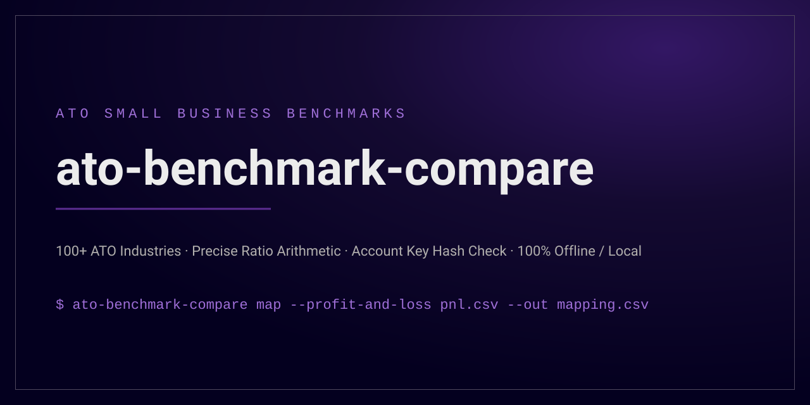

# ato-benchmark-compare

```
+----------------------------------------------------------------------+
|                        ato-benchmark-compare                         |
+----------------------------------------------------------------------+
|           Offline variance analysis against ATO benchmarks           |
+----------------------------------+-----------------------------------+
| DR  what it gives you            | CR  what it needs                 |
+----------------------------------+-----------------------------------+
| ATO benchmark ratio compare      | P and L figures per account       |
| accurate turnover definition     | account to label mapping          |
| shows the working per account    | -                                 |
+----------------------------------+-----------------------------------+
```



[](https://github.com/ryanduguid/australian-accounting/actions/workflows/ci-ato-benchmark-compare.yml)
[](https://pypi.org/project/ato-benchmark-compare/)
[](LICENSE)
[](https://www.python.org/)

Compare a set of profit and loss figures against the ATO small business benchmarks,
on your own machine, with the working shown.

The ATO publishes benchmark ranges for 100 industries and uses them to pick which
small businesses to look at more closely. Checking a client against them is a
sensible thing to do before lodgment, and it is usually done by hand: find the
industry page, work out which turnover range applies, add up the right accounts, and
divide. This does that, and it records which accounts went into which figure so the
answer can be checked by someone else later.

Australian tax rules only. Every figure comes from the ATO's own published dataset,
and the comparison is a comparison, not advice.

The published Python distribution and command remain `ato-benchmark-compare`, and the
import package remains `atobenchmark`.

## What it gets right

The arithmetic is not "expenses over income". The ATO defines these ratios narrowly,
and the differences change the answer:

- **Turnover** is the sales of goods and services label, not total income. It falls
  back to total business income only when sales are blank, zero, or less than 50% of
  total business income.
- **Total expenses** for the ratio is total expenses **less payments to associated
  persons**. Wages to a spouse or an associated entity come out before the division.
- **Cost of sales** for the ratio **excludes salary and wages**, so the wages sitting
  in a bakery's cost of sales are moved out of the numerator and stay in total
  expenses.
- **The key range** is cost of sales to turnover where the ATO publishes one for that
  industry, otherwise total expenses to turnover.
- **Turnover bands** are treated as adjoining. The ATO prints `$65,000 - $400,000`
  then `$400,001 - $750,000`, which read literally leaves $400,000.50 in no band at
  all.

Source: Australian Taxation Office, [How we calculate benchmark
ratios](https://www.ato.gov.au/businesses-and-organisations/income-deductions-and-concessions/small-business-benchmarks/small-business-benchmarks-methodology-and-ratio-calculations/how-we-calculate-benchmark-ratios)
(QC 37143).

## Excel workbook

No Python? [`workbooks/ato-benchmark-compare.xlsx`](workbooks/ato-benchmark-compare.xlsx)
is the same comparison in ordinary worksheet formulas: paste the profit and loss,
review the mapping, pick the industry and read the result. It is macro-free, needs
desktop Excel for Microsoft 365 or Excel 2024, and is held to this engine's answer
by `tests/test_workbook.py`. See [workbooks/README.md](workbooks/README.md).

## Install

```bash
git clone https://github.com/ryanduguid/australian-accounting.git
cd australian-accounting/packages/ato-benchmark-compare
pip install .
```

Python 3.10 or later. The runtime has no dependencies at all: the benchmark data
ships inside the package and nothing is fetched at run time.

`pip install ato-benchmark-compare` installs the same package from PyPI; clone the
repository when you want the example files used below.

## Use it

The flow is two commands, because the middle step is a person reading the ledger.

**1. Draft a mapping from the profit and loss.**

```bash
ato-benchmark-compare map --profit-and-loss examples/bakery-pnl.csv --out mapping.csv
```

That writes one row per account with a suggested bucket, the reason it was suggested,
and the amount it read. Suggestions come from account names alone.

**2. Review it.** Open `mapping.csv`, fix the buckets, and change the `source` column
to `reviewed`. `ato-benchmark-compare buckets` explains each bucket. This is the step
that decides whether the answer is worth anything: no account name tells you whether
wages went to an associate.

The generated mapping includes an `account_key` immediately after `account`. It is a
SHA-256 digest of the tool's existing case-and-whitespace-insensitive account identity.
Leave both columns unchanged while reviewing `bucket`, `source` and `note`; `amount` is
shown for context and is not bound by the key. On the next run, the key lets the tool
recover a formula-guarded logical account without confusing `=cmd|calc` with the genuine
account `'=cmd|calc` when both look the same in a spreadsheet.

`account_key` is an identity integrity check, not authentication or tamper resistance.
Anyone who can edit the file can recompute it, and case- or whitespace-only account edits
remain valid by design. Older mappings without the column remain readable for ordinary,
unambiguous account names. A legacy formula-like name or one that could already contain a
spreadsheet guard must be regenerated; reapply the reviewed bucket, source and note values
to the new mapping. Profit and loss input parsing strips and normalises leading whitespace,
so leading tab, carriage-return and newline prefixes are not distinct raw-ledger identities.

**3. Compare.**

```bash
ato-benchmark-compare compare \
  --profit-and-loss examples/bakery-pnl.csv \
  --mapping examples/bakery-mapping.csv \
  --industry "Bakeries and hot bread shops"
```

```
ATO small business benchmark comparison
=======================================
Business type:  Bakeries and hot bread shops
Benchmark year: 2023-24
Turnover:       $850,000.00 (sales of goods and services)
Turnover band:  More than $750,000

Ratio                                   This business  ATO range         Result
---------------------------------------------------------------------------------
Cost of sales to turnover (key)         31.76%         29% to 36%        within
Total expenses to turnover              83.17%         82% to 90%        within
Labour to turnover                      32.68%         -                 no benchmark in this dataset
Rent to turnover                        7.29%          -                 no benchmark in this dataset
Motor vehicle expenses to turnover      1.12%          -                 no benchmark in this dataset

Figures used
  Sales of goods and services   $850,000.00
  Other business income         $1,200.00
  Total business income         $851,200.00
  Total expenses                $751,950.00
  Less payments to associates   $45,000.00
  Total expenses for the ratio  $706,950.00
  Cost of sales excluding wages $270,000.00
  Labour                        $277,800.00
```

Add `--json result.json` for the same result as structured data, including every
bucket total and the source metadata.

Library callers that distinguish an omitted figure from an evidenced zero can use
`atobenchmark.to_evidenced_dict(comparison, supplied_fields)`; include `w1` in that
collection when it was supplied.
The serializer masks ratios and prose whose required inputs were not supplied and
returns `supplied_buckets`, `omitted_buckets`, and `complete_buckets` alongside the
ordinary comparison payload.

Other commands:

```bash
ato-benchmark-compare industries --search cleaning   # find the ATO business type
ato-benchmark-compare show "Bakeries and hot bread shops"
ato-benchmark-compare buckets
```

## Input formats

The format this tool guarantees is two columns, with an optional `section` column of
`income`, `cost_of_sales` or `expense`:

```csv
account,amount
Sales,850000
Purchases,290000
```

A report style export, with a title block, section headings and subtotal rows, is
also read. Subtotal rows are detected and written into the mapping marked `excluded`
rather than dropped, so a total can never be quietly added to the figures it totals,
and nothing vanishes without appearing in a file you can read. Amounts are taken from
the first column that parses as amounts; `--amount-column` takes a column number or a
column heading when a comparative export has more than one.

**The report style layout is inferred.** It was written against the shape these
exports normally take, not verified against a real export from any particular
accounting package. Check the mapping file against your own export the first time,
and use `--amount-column` if it picked the wrong period.

## Buckets

| Bucket | What the ATO does with it |
| --- | --- |
| `turnover` | Sales of goods and services. The turnover denominator. |
| `other_income` | Business income that is not sales. Only reaches turnover through the fallback rule. |
| `cost_of_sales` | Cost of sales, excluding wages inside it. |
| `cost_of_sales_labour` | Wages inside cost of sales. Kept out of the cost of sales ratio, kept in total expenses and labour. |
| `salary_wages` | Salary and wages outside cost of sales. |
| `contractor_commission` | Contractor, subcontractor and commission expenses. |
| `associated_persons` | Payments to associated persons. Deducted from total expenses. The wage buckets already exclude these, so labour deducts nothing further. |
| `rent` | Rent expenses. |
| `motor_vehicle` | Motor vehicle expenses. |
| `other_expense` | Every other expense, including superannuation and depreciation. |
| `excluded` | Outside the ATO calculation: income tax expense, subtotal rows. |

## Exit codes

| Code | Meaning |
| --- | --- |
| 0 | Comparison produced, nothing to flag: key ratio inside the ATO range, or no published range applies to this turnover |
| 1 | Could not produce a comparison, for example an account with no mapping entry |
| 2 | Comparison produced, key ratio outside the ATO range |
| 3 | Comparison produced, but accounts still carry suggested buckets |

## What it does not do

- It is not tax advice, and sitting outside a range is not a finding that anything is
  wrong. The ATO publishes ranges precisely because businesses differ.
- The bulk dataset the ATO publishes carries the two key ratios only. Labour, rent
  and motor vehicle ratios are calculated and shown, but the ranges for them are on
  the ATO's individual industry pages and are not in this dataset yet.
- Activity statement benchmarks are not covered. The ATO has not produced them since
  1 July 2017.
- It reads a profit and loss. It does not read a tax return, so it cannot see the
  W1 label, the salary and wages code, or anything else that only exists at lodgment.
  Pass `--w1` if you want the ATO's W1 rule applied to the labour ratio.

## Client data

Nothing leaves the machine. There is no network call anywhere in the runtime.

The `.gitignore` blocks the file names a real ledger arrives under, including
`pnl*.csv`, `mapping*.csv`, spreadsheets, and `client-data/`. The example files are
invented. Do not commit a real one.

## Benchmark data

| Year | Business types | Source |
| --- | --- | --- |
| 2023-24 | 100 | [ATO Small Business Benchmarks, data.gov.au](https://data.gov.au/data/dataset/small-business-benchmarks) |
| 2022-23 | 100 | same dataset |

Each shipped file records the resource URL, the date it was retrieved, and the SHA-256
of the ATO workbook it was built from. The comparison prints all of that, so a report
can be traced back to a specific published file.

To add a year when the ATO publishes one:

```bash
uv run --with openpyxl python tools/build_dataset.py \
  --xlsx small-business-benchmarks-2024-25-data.xlsx \
  --year 2024-25 \
  --resource-name "2024-25 Benchmarks" \
  --resource-url https://data.gov.au/... \
  --resource-last-modified 2027-03-15T00:00:00 \
  --retrieved 2027-03-20 \
  --out atobenchmark/data/benchmarks-2024-25.json
```

The builder refuses a workbook whose columns are not where it expects them, rather
than quietly producing a dataset with the ratios in the wrong places.

### Attribution

The benchmark figures are derived from Australian Taxation Office data, [Small
Business Benchmarks](https://data.gov.au/data/dataset/small-business-benchmarks),
used under [CC BY 2.5 AU](https://creativecommons.org/licenses/by/2.5/au/). The data
has been converted from the ATO's spreadsheet into JSON, and turnover band bounds
have been made adjoining as described above. No published ratio has been altered.
The ATO has not endorsed this tool and has nothing to do with it.

The code in this repository is MIT licensed. The data attribution is also
recorded in [NOTICE](NOTICE), which ships inside the wheel and the sdist.

## Author

Written by Ryan Duguid, a provisional member of Chartered Accountants ANZ,
independently, in his own time and on his own equipment. Nothing here is the work of
any employer, and no client data was used to build or test it.

Every ATO rule it
implements was checked against the ATO's own published pages, and the shipped
benchmark figures were cross checked against the ATO's industry page for the same
industry.
